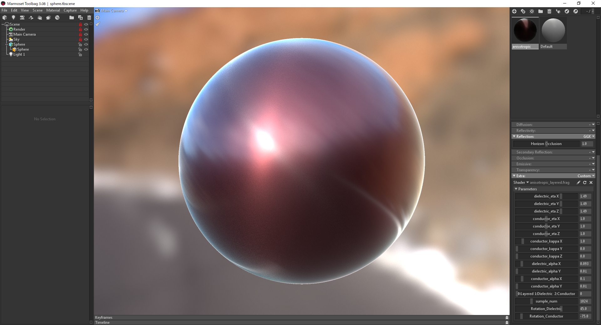

Real-time Rendering of Layered Materials with Anisotropic Normal Distributions
===

# Overview

This is an official implementation of the paper "[Real-time Rendering of Layered Materials with Anisotropic Normal Distributions](https://tatsy.github.io/projects/anisolayer19/)".

# Description
- 
- 

# Build & Run
You will 
Use [Marmoset Toolbag 3](https://marmoset.co/toolbag/) to build and run the program.
Please install [Marmoset Toolbag 3](https://marmoset.co/toolbag/) to your computer beforehand.

For **Windows**, 
1. Move 'BRDF' and 'anisotropic_layered.frag' to '${Toolbag 3}\data\shader\mat\custom' directory.

# Example

We included a simple scene(sphere.tbscene).
