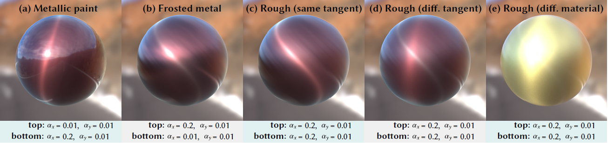

Real-time Rendering of Layered Materials with Anisotropic Normal Distributions
===

# Overview

This is an official implementation of the paper "Real-time Rendering of Layered Materials with Anisotropic Normal Distributions" (SIGGRAPH ASIA 2019 Tech. brief).

# Description
- BRDF & anisotropic_layered.frag: source code
- figs: sample images
- sphere.tbscene: sample scene

# Build & Run
You will 
Use [Marmoset Toolbag 3](https://marmoset.co/toolbag/) to build and run the program.  
Please install [Marmoset Toolbag 3](https://marmoset.co/toolbag/) to your computer beforehand.

For **Windows**, 
1. Move 'BRDF' and 'anisotropic_layered.frag' to 'Toolbag 3/data/shader/mat/custom' directory
2. Launch Marmoset Toolbag 3
3. Open the sample scene (sphere.tbscene)

# Example

We included a simple scene (sphere.tbscene) .

# License

This software is released under the MIT License, see LICENSE.txt.